# BTT假币攻击事件细节披露及修复方案

波场DApp tronbank于4月11日凌晨1点遭受假币攻击。

 

11日上午Beosin成都链安技术团队作出初步分析，判断该次假币攻击事件主要原因，在于合约没有严格验证代币的唯一标识符代币ＩＤ，错误的将攻击者自己发行的无价值代币识别为价值85万元的BTT代币，从而造成了损失。同时及时发出预警，预判黑客团队未来可能将攻击重点转向波场。

 

现针对此次事件，我们成都链安的技术团队进一步作出深度分析。

 

## 黑客攻击手法解析

 

首先，我们先看此次BTT假币攻击事件中的漏洞源码，如下图：

经过分析发现，该假币漏洞是由于invest函数只判断了msg.tokenvalue，而没有判断msg.tokenid是否为真实BTT代币的ID：1002000所导致。

 

TRC10标准是波场本身支持的技术代币标准，标准规定了两个重要参数：msg.tokenvalue和msg.tokenid。其中msg.tokenvalue表示当前msg调用的代币数量，而msg.tokenid表示当前调用者使用的代币种类标记ID。每种TRC10标准的代币都有一个独一无二的标记ID作为代币种类证明。

 

BTTBank合约在收取代币时没有对收到代币的tokenid做任何判断，合约中仅仅判断了msg发送代币的数量msg.tokenvalue。

 

当合约收到调用者发送的代币数量msg.tokenvalue时，合约错误的认为该代币数量是BTT的数量。但实际上调用者使用的是假币tokenid为1002278的代币数量。BTTBank将假币视同于真币（真币的tokenid为10022000）记录到投资者账号。

 

而攻击者账号TRC10代币中存在BTT和BTTx两种代币，可见两种代币的ID差异，BTT代币ID：1002000，BTTx代币ID：1002278。

 

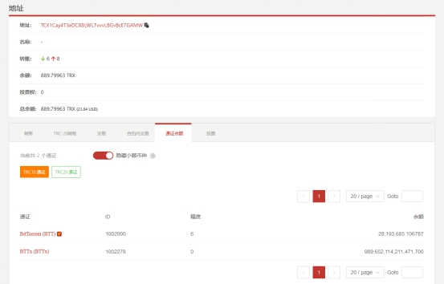

 

攻击者于4月11日凌晨创建发行990,000,000,000,000,000个名为BTTx的假币（代币ID：1002278）

 

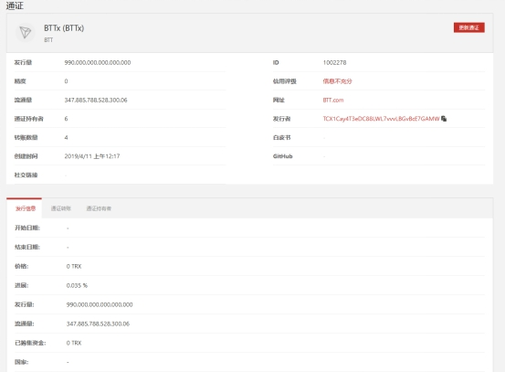

 

假币创建完成后，攻击者将创建的四千万假币BTTx发送给四个攻击小号：

TB9jB76Bk4tk2VhzGAb6t1aCYgW7Z4iicY，

TQM4uEWPQvVe2kGbWPZtVLMDFrTLERfmp4，

TKp1stjapNqr4pkDQjU9GTitsYBUrKAGkh，

TF2EWZJZSokGdtk4fj7PqCmuGpJasVXJ3K。

 

 

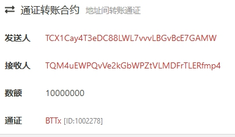

 

当攻击小号收到假币后，攻击者又调用BTTBank合约有缺陷的invest函数。

 

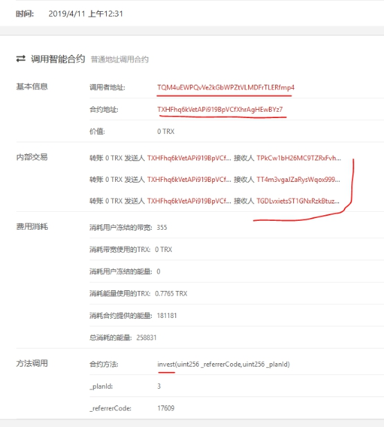

 

接下来在触发invest函数后，BTTBank项目方将大量BTT转入了预先设置的投资账号TPk，TT4，TGD，这笔资金实际上未被黑客获得，但项目方在没有收到BTT的情况下进行了真实的投资。

 

下图为源码中对三个投资地址的具体设置代码：

 

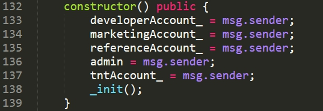

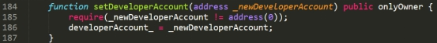

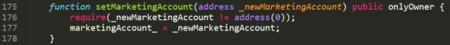

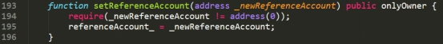

BTTBank投资的三个投资账号中都收到了大量BTT代币，如下图所示。

 

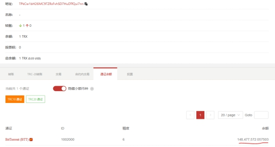

 

 

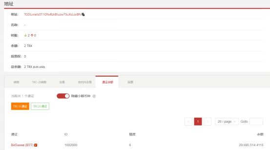

黑客触发invest函数后通过withdraw函数取到了BTTBank奖励池的真正的BTT代币，最终四个小号将赃款集中转向黑客主账号TCX1Cay4T3eDC88LWL7vvvLBGvBcE7GAMW

 

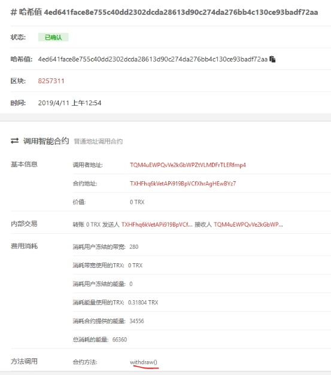

 

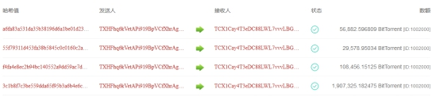

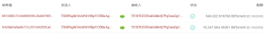

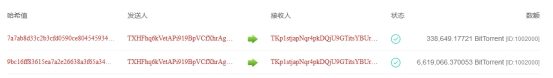

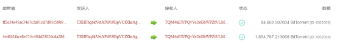

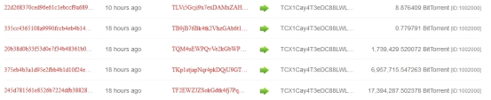

攻击者账户中的BTT赃款和攻击使用的假币BTTx如下：

 

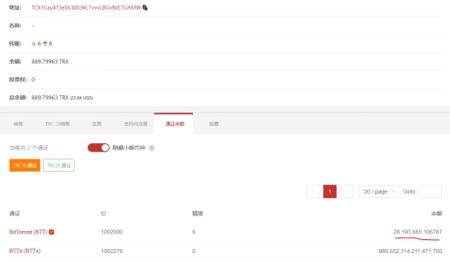

 

此外，我们对在Github上开源的其他项目方代码进行检查，发现还有其他项目方存在此安全问题：

如下为有问题的合约地址：

 

TF3YXXXXXXXXXXXXXXXXXXXXXXXWt3hx

 

TKHNXXXXXXXXXXXXXXXXXXXXXXXAEzx5

 

TK8NXXXXXXXXXXXXXXXXXXXXXXXZkQy

 

TUvUXXXXXXXXXXXXXXXXXXXXXXXxLETV

 

TG17XXXXXXXXXXXXXXXXXXXXXXXkQ9i

 

因此我们呼吁广大项目方提高警惕予以重视，检查自己的合约是否存在上述安全漏洞，并及时进行更新。

 

## 事件发生原因

 

据我们技术团队分析，上述问题的发生存在两个方面的原因：

 

1）开发者对波场代币的使用机制研究不足，可能套用了以太坊的代币使用方法；

2）攻击者在迁移其它公链上存在的攻击方式，如EOS已经存在的假币攻击方式。

 

## 修复意见

对此，我们建议：项目方在收取代币时应同时判断msg.tokenvalue和msg.tokenid是否符合预期。

 

该漏洞代码修复方式，如下：

 

**Invest函数增加代码：**

require(msg.tokenid==1002000)；

require(msg.tokenvalue >= minimum)；

 minimum是最小投资额

 

同时，Beosin成都链安提示：黑客团队未来可能将攻击重点转向波场，波场公链的DApp市场高度繁荣但一直未曾遭到过eos公链级别的高强度攻击，攻击者目前主要是将其他公链上已成熟的攻击方式迁移到波场并进行大范围攻击测试，寻找安全防护较为薄弱的合约，此阶段后，攻击者可能更进一步深度挖掘波场本身可能被利用的机制，进行更高强度、更具威胁力的攻击。

 

我们再次提醒各大项目方加强合约的安全防护级别和安全运维强度，尽量防范未然，避免不必要的损失，必要时可联系第三方专业审计团队，在上链前进行完善的代码安全审计，共同维护公链安全生态。

 

 

 

 

 

 

 

 

 

 

 

 

 