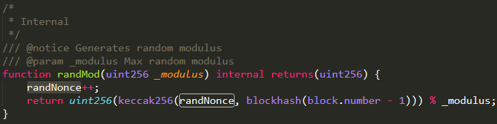

据成都链安科技消息，MyCryptoChamp游戏合约随机数“不随机”，影响游戏公平性。

MyCryptoChamp合约的RandMod函数中使用合约的私有变量randNonce和父块哈希作为参数生成随机数，用户可以通过web3.eth.getStorageAt()函数获取randNonce的值，而父块hash在合约内外都可以读取到。

攻击者可以利用获得的两者数值，通过外部合约计算出较理想的随机数，并在此时参与游戏，新的角色及物品属性就会按照该理想数值生成，进而影响游戏公平性，实现了以较小的成本（gas消耗）获得较大利益。

根据Solidity官方建议，合约开发者可以使用链外的第三方服务，比如Oraclize来获取随机数。成都链安科技提醒所有项目方，进行代码安全审计是项目上链前不可缺少的重要安全举措，必要时可以借助第三方专业审计团队的力量防患于未然。

 

