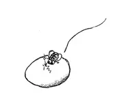

引子：“夫未战而庙算胜者,得算多也;未战而庙算不胜者,得算少也。多算胜少算，而况于无算乎？”

                                                      ——《孙子兵法》

**1.相关消息动态**

7月24日早些时候有EOS游戏的智能合约爆出安全漏洞，相关安全团队形容其漏洞为“薅羊毛”[1]（具体分析请见引用1  ）。

同一天有个关注者发现同一份合约又存在更改账户权限的问题，并警示进入游戏的用户保护好自己的资金安全[2]（相关阐述件引用2 ）。

对此，相关团队也进行了测试验证[3]（测试过程请见引用3 ）。

7月25日，有个人用户发现其网站主页EOS总数出现异常，疑似受到溢出攻击[4] (疑似事件情况请见引用4)。

事件真相正在进一步发酵中，链安团队也将跟进调查事件进展。

**2.事件回响**

回首2016年的以太坊游戏The King of the Ether Throne, 当时也被利用了外部函数调用的漏洞，遭到通过（Unexpected）Revert 发动的DoS攻击，导致该游戏运营出现重大问题，相应的分析链安科技团队会在本周的漏洞分析连载中进行分享，敬请关注“链安科技”的公众号和相关媒体的技术专栏。

鉴于目前基于EOS的游戏如雨后春笋般出现，其合约的复杂程度相较于代币交易合约大大增加，漏洞的出现几率随之提高

俗话说，苍蝇不叮无缝蛋。

一旦合约出现问题，相关游戏项目方将首当其冲，我们正在持续关注区块链游戏的发展，并已经展开对游戏智能合约的漏洞测试和安全审计筹备，未雨绸缪。

但局限于目前所有类似游戏并没有开源，我们无法对其从源码到目标码展开专业的形式化验证或使用我们研制的完全自动化的验证工具。

秉承着团队学术背景严谨治学的精神，我们将在高效率高质量的全方位剖析之后，给出合约潜在漏洞的专业分析和解决方案。

 **3.链安之见**

因此，链安科技团队向广大游戏合约开发者呼吁：

1. 对待合约开发要以更严谨更规范的态度脚踏实地的为之后的顺利运营打下坚实的基础。
2. 尽快将合约代码开源，让更多的专业人士和技术团队参与进来，分析整理出易发生的意外事件，提升合约编写的安全性和功能准确性，防患于未然。
3. 在合约上线之前，一定要有专业的团队对合约代码进行漏洞检测及安全审计。

链安科技团队持续关注区块链游戏合约的安全问题，已经对多个类似的游戏合约展开全面排查，一旦发现可被攻击者利用的安全问题，将第一时间通知项目方，保障游戏项目方以及广大用户的利益。

引用：

1. https://mp.weixin.qq.com/s/EDSlYEA1xHGVa41Uicf8qg
2. https://bihu.com/article/992656
3. https://bihu.com/article/986206
4. https://bihu.com/article/995093