**案情回放**

8月22日中午，区块链游戏God.Game宣布游戏内所有代币被攻击者卷走，项目方筹备两个月游戏在运营不久后迅速夭折。

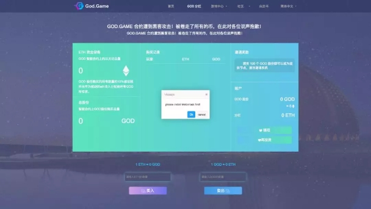

成都链安科技团队得知此消息之后，没有等待黑客攻击地址被公布，立即展开了对合约源代码的审计，从代码逻辑和功能准确性等根源问题入手，定位攻击者利用的漏洞，并复原了“案发现场”。

**漏洞定位**

成都链安科技合约审计团队对源代码进行漏洞排查后发现漏洞原因为dividends变量异常：

首先看一下dividends的计算逻辑：

return(uint256)((int256)(profitPerShare_*tokenBalanceLedger_[_customerAddress])- payoutsTo_[_customerAddress]) / magnitude;

每当一个地址token增加或减少操作时，都会对该地址的payoutsTo这个变量进行操作，购买token增加payoutsTo变量：

卖出或转账token减少payoutsTo变量：

这些都很容易理解。

但是在转账逻辑我们却发现，对于合约地址，是没有payoutsTo的，这个疑点先记在小本本上。

这是源码的转账部分

转账：

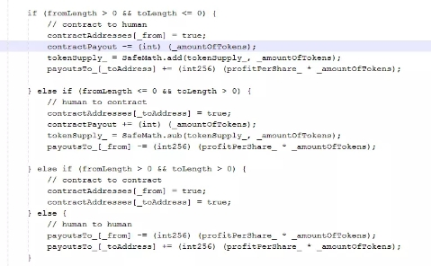

我们再仔细查看一下withdraw函数里面：

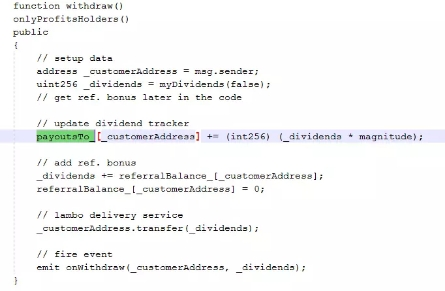

我们惊讶的发现在withdraw函数中，会对payoutsTo进行一个赋值操作，赋值为dividends*magnitude；这里magnitude=2**64；

从上面dividends的逻辑的(profitPerShare_*tokenBalanceLedger_[_customerAddress])部分可以看出，只要有账户有token那dividends就一定有值的，dividends有值我们就可以进行withdraw操作。

**攻击流程推理**

1. 首先创建一个攻击合约并转入一定token，调用一次withdraw之后，该攻击合约地址对应的payoutsTo值变为dividends*magnitude；

2. 然后再将攻击合约中token转走，使其token为0，由于原合约转账逻辑中并没有对合约类型地址的payoutsTo做处理，所以攻击合约地址对应的payoutsTo值在原合约看来并没有减少；现在将payoutsTo带入dividends的计算中：(uint256) ((int256)(profitPerShare_ * tokenBalanceLedger_[_customerAddress]) - payoutsTo_[_customerAddress]) / magnitude由于合约token已经全部转走，tokenBalanceLedger=0,所以此时(profitPerShare_ * tokenBalanceLedger_[_customerAddress])=0；payoutTo也为int256

   那么简化公式之后上面复杂的公式变为uint256 (int256(0-payoutsTo))/magnitude；

   (uint256) ((int256)表示的是：uint256对一个int负数强制转化为一个uint无符号数，导致值变成了一个很大的正数。最终导致dividends异常增加。

3. 最终通过调用reinvest功能使用dividens购买大量token，买入token增加后导致token价格增加。最后通过卖出token的方式转走游戏合约中的以太坊。

**攻击流程总结**

（1）创建一个攻击合约，可以调用God合约并且向该合约转入几个God token

（2）攻击合约调用God合约withdraw的函数，触发payouts[address]值增加

（3）调用攻击合约将攻击合约中的God token全部转出，使合约token=0，攻击合约地址的dividends出现异常

（4）调用reinvest()可以使用异常devidends购买大量token，因为合约token总量增加，分红增加，token价格上涨，此时任何人都可以卖出少量token来获取到大量的eth

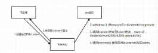

蛛丝马迹

我们查看游戏合约异常的dividends证据：

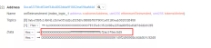

红框内“00000000ffffffffff”的类似结构代表其为负数

由此证明dividends确实出现了类型转换异常的情况。

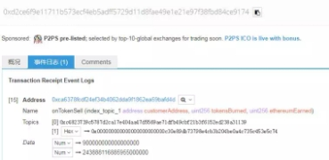

攻击者通过攻击合约调用God合约的reinvest()函数，使用异常的dividends购买了大量God代币，总量约为300亿，此时代币价格迅速攀升，最后，攻击者只卖出了0.9个token就已经将合约中的200多以太坊转走。

**攻击流程复现**

**复现环境****：**

Ropsten测试链

**复现步骤****：**

1.部署God合约在测试链上，God地址: 0x92cbCBc31f6bb209f2C4F6cbd0596ba22D71979d

2.普通用户支付1 ETH购买代币

3.攻击者支付0.1 ETH购买代币

4.攻击者部署攻击合约PWN，PWN合约地址：0x88DF1483Db9d3720378d2CB6859c8487e4412ac7

攻击合约代码地址：https://ropsten.etherscan.io/address/0x88DF1483Db9d3720378d2CB6859c8487e4412ac7#code

5.攻击者向PWN合约转4 GOD代币

6.攻击通过PWN合约调用God合约的withdraw函数，使PWN合约的payoutsTo_变为

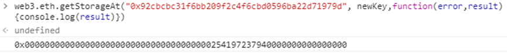

7.攻击者转出PWN合约下的God代币，使得tokenBalanceLedger_为零，此时计算PWN合约的dividendsOf值所需参数的值为：

profitPerShare_ = 8997439772575371

tokenBalanceLedger_[PWN] = 0

payoutsTo_[PWN] = 0x254197237940000000000000000

执行dividendsOf函数，得到PWN合约地址的分红为dividendsOf = uint(-0x25419723794)，此处在由int转化为uint中出现错误：

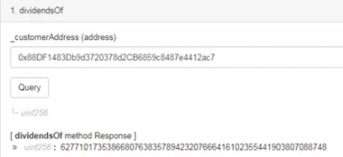

8.攻击者通过PWN合约调用GOD合约reinvest函数，利用超大的dividendsOf值购买代币，获得了大量代币，使得profitPerShare提升到极大值，进而破坏了God 与ETH之间的汇率

**异常的profitPerShare值**

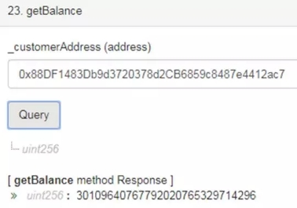

**PWN购买的God代币数**

9.God合约的代币数量与主链上数量相近，复现成功

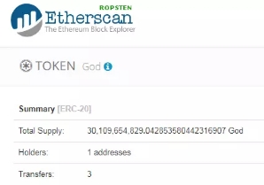

测试God合约代币总量300亿

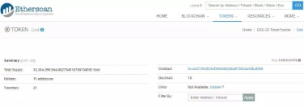

真实God合约代币总量330亿

**总结**

经由以上推理与证据的理论验证，以及复现与真实的数据验证，我们确定此次攻击手段定义为类型转换漏洞攻击。

攻击者巧妙利用God合约的设计漏洞，在计算dividends时，未考虑int类型的负值转化为uint时的情况，导致合约被攻击。

从Etherscan上查到的信息来看，部署攻击合约为8月20日04:42:27 PM，卷走ETH为04:57:26 PM。黑客仅仅用了15分钟完成上述所有操作。

除此漏洞之外，我们还在合约中发现如下两个“后门”，God合约的owner（在下列代码中体现为Administrator）可以使用这两个函数转出合约地址下的所有ETH。

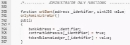

此处Administrator可以指定任意账户的代币数，然后可以将这部分代币数兑换为ETH

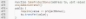

此处Administrator取走项目奖励时没有减去已经取走的value值，导致Administrator可以重复取出ETH。

总而言之，目前的游戏合约，尤其是交易属性较重的游戏合约，安全漏洞出现的情况非常普遍，成都链安科技提醒广大玩家和投资者，在进入一些“一夜爆红”的游戏之前，要擦亮眼睛，理智投资，最好是参与已经提供审计报告的区块链游戏，对于未经过合约安全验证的游戏不可盲从。同时，各游戏项目方也应该在游戏上线前做好对智能合约的安全审计，以保护自己的项目运营和玩家的资产安全。